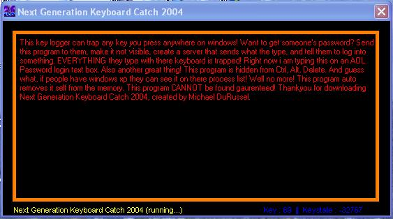



## KeyCapture

### Description

Next Generation Keyboard Catch 2004 will trap almost every key on the keyboard and put it into a label. The program is removed from memory and is not on the process's list and is also not on the Ctrl, Alt, Del list. Take a look at the screen shot! The keylogger can catch anything pressed on the keyboard no madder where it is. If you set the form's visible property to false, you can type stuff in other applications and it will appear on the keylogger! Typing passwords in a program? The keyloggers got it!
 
### More Info
 

             |
---                |---
**Submitted On**   |2002-09-22 14:20:10
**By**             |[Michael Du Russel](https://github.com/Planet-Source-Code/PSCIndex/blob/master/ByAuthor/michael-du-russel.md)
**Level**          |Intermediate
**User Rating**    |4.8 (19 globes from 4 users)
**Compatibility**  |VB 5\.0, VB 6\.0
**Category**       |[Files/ File Controls/ Input/ Output](https://github.com/Planet-Source-Code/PSCIndex/blob/master/ByCategory/files-file-controls-input-output__1-3.md)
**World**          |[Visual Basic](https://github.com/Planet-Source-Code/PSCIndex/blob/master/ByWorld/visual-basic.md)
**Archive File**   |[KeyCapture1345129222002\.zip](https://github.com/Planet-Source-Code/michael-du-russel-keycapture__1-39184/archive/master.zip)

